<p align="center">
  
</p>

<h1 align="center">PocketPaw</h1>

<p align="center">
  <strong>Your AI agent. Modular. Secure. Everywhere.</strong>
</p>

<p align="center">
  <a href="https://pypi.org/project/pocketpaw/"></a>
  <a href="https://opensource.org/licenses/MIT"></a>
  <a href="https://www.python.org/downloads/"></a>
  <a href="https://pypi.org/project/pocketpaw/"></a>
</p>

<p align="center">
  <a href="https://github.com/pocketpaw/pocketpaw/releases/latest/download/PocketPaw-macOS-arm64.dmg"></a>
  &nbsp;
  <a href="https://github.com/pocketpaw/pocketpaw/releases/latest/download/PocketPaw-Setup.exe"></a>
</p>

<p align="center">
  Self-hosted, multi-agent AI platform. Web dashboard + <strong>Discord</strong>, <strong>Slack</strong>, <strong>WhatsApp</strong>, <strong>Telegram</strong>, and more.<br>
  No subscription. No cloud lock-in. Just you and your Paw.
</p>

> **🚧 Beta:** This project is under active development. Expect breaking changes between versions.

<p align="center">
  <video src="https://github.com/user-attachments/assets/3e3b3128-bf90-4dfe-a2ec-94116e4b3c25" width="700" controls></video>
</p>

---

## Quick Start

```bash
curl -fsSL https://pocketpaw.xyz/install.sh | sh
```

Or install directly:

```bash
pip install pocketpaw && pocketpaw
```

**That's it.** One command. 30 seconds. Your own AI agent.

I'm your self-hosted, cross-platform personal AI agent. The web dashboard opens automatically. Talk to me right in your browser, or connect me to Discord, Slack, WhatsApp, or Telegram and control me from anywhere. I run on _your_ machine, respect _your_ privacy, and I'm always here.

**No subscription. No cloud lock-in. Just you and me.**

<details>
<summary>More install options</summary>

```bash
# Isolated install
pipx install pocketpaw && pocketpaw

# Run without installing
uvx pocketpaw

# From source
git clone https://github.com/pocketpaw/pocketpaw.git
cd pocketpaw
uv run pocketpaw
```

</details>

PocketPaw will open the web dashboard in your browser and be ready to go.
No Docker. No config files. No YAML. No dependency hell.

**Talk to your agent from anywhere:**
Telegram · Discord · Slack · WhatsApp · Web Dashboard

---

## What Can PocketPaw Do?

| Feature | Description |
| --- | --- |
| **Web Dashboard** | Browser-based control panel, the default mode. No setup needed. |
| **Multi-Channel** | Discord, Slack, WhatsApp (Personal + Business), Signal, Matrix, Teams, Google Chat, Telegram |
| **Claude Agent SDK** | Default backend. Official Claude SDK with built-in tools (Bash, Read, Write). |
| **Smart Model Router** | Auto-selects Haiku / Sonnet / Opus based on task complexity |
| **Tool Policy** | Allow/deny control over which tools the agent can use |
| **Plan Mode** | Require approval before the agent runs shell commands or edits files |
| **Browser Control** | Browse the web, fill forms, click buttons via accessibility tree |
| **Gmail Integration** | Search, read, and send emails via OAuth (no app passwords) |
| **Calendar Integration** | List events, create meetings, meeting prep briefings |
| **Google Drive & Docs** | List, download, upload, share files; read and create documents |
| **Web Search & Research** | Tavily/Brave search + multi-step research with source synthesis |
| **Image Generation** | Google Gemini image generation, saved locally |
| **Voice / TTS / STT** | Text-to-speech via OpenAI or ElevenLabs, speech-to-text via Whisper |
| **Spotify** | Search tracks, playback control, playlist management |
| **Reddit** | Search posts, read threads, browse trending topics |
| **OCR** | Extract text from images via GPT-4o vision or pytesseract |
| **Memory & Compaction** | Long-term facts + session history with smart compaction + Mem0 semantic search |
| **MCP Support** | Connect Model Context Protocol servers (stdio + HTTP) |
| **Cron Scheduler** | Recurring reminders with natural language time parsing |
| **Security Suite** | Injection scanner, audit CLI, Guardian AI, self-audit daemon |
| **Local-First** | Runs on YOUR machine. Your data never leaves your computer. |
| **Cross-Platform** | macOS, Windows, Linux |
| **Skill System** | Create reusable agent skills at runtime |
| **Task Delegation** | Delegate complex sub-tasks to Claude Code CLI |

### Examples

```
You:  "Every Sunday evening, remind me which recycling bins to put out"
Paw:  *creates a recurring schedule*
Paw:  "Done. I'll check the recycling calendar and message you every Sunday at 6pm."

You:  "Organize my Downloads folder. PDFs by date, images by type, delete duplicates"
Paw:  *scans filesystem, moves 47 files, removes 12 duplicates*
Paw:  "All clean. Here's what I did: [summary]"
```

### Research & Browsing

```
You:  *drops a link*
Paw:  *opens browser, reads the page, researches related topics*
Paw:  "Here's a summary with 3 key takeaways. Want me to save this to memory?"
```

### Coding & DevOps

```
You:  "Find that memory leak, the app crashes after 2 hours"
Paw:  *reads logs, profiles code, identifies the issue*
Paw:  "Found it. The WebSocket handler never closes connections. Here's the fix."
```

### Multi-Agent Workflows (Mission Control)

```
You:  "I need a competitor analysis report for our product launch"
Paw:  *spins up Agent A: web researcher, Agent B: data analyst, Agent C: writer*
Paw:  "3 agents working on it. Agent A is scraping competitor sites,
       Agent B is analyzing pricing data, Agent C is waiting to write the report.
       I'll ping you when it's ready."
```

---

## Web Dashboard

The browser-based dashboard is the default mode. Run `pocketpaw` and it opens at `http://localhost:8888`.

What you get:

- Real-time streaming chat via WebSocket
- Session management: create, switch, search, and resume conversations
- Activity panel showing tool calls, thinking, and system events
- Settings panel for LLM, backend, and tool policy configuration
- Channel management: configure, start, and stop adapters from the sidebar
- MCP server management: add, configure, and monitor MCP servers
- Plan Mode approval modal for reviewing tool calls before execution

### Channel Management

All configured channel adapters auto-start on launch. Use the sidebar "Channels" button to:

- Configure tokens and credentials per channel
- Start/stop adapters dynamically
- See running status at a glance

Headless mode is also available for running without the dashboard:

```bash
pocketpaw --discord              # Discord only
pocketpaw --slack                # Slack only
pocketpaw --whatsapp             # WhatsApp only
pocketpaw --discord --slack      # Multiple channels
pocketpaw --telegram             # Legacy Telegram mode
```

See [Channel Adapters documentation](documentation/features/channels.md) for full setup guides.

---

## Browser

Uses your existing Chrome if you have it. No extra downloads. If you don't have Chrome, a small browser is downloaded automatically on first use.

---

## Architecture

```mermaid
graph TD
    %% Node Definitions
    User(["YOU <br/>(Web / Discord / Slack / WhatsApp / Telegram)"])

    subgraph Channels ["Channel Adapters"]
        Adapters["WebSocket Dashboard  •  Discord  •  Slack<br/>WhatsApp  •  Telegram  •  Signal  •  Matrix<br/>Teams  •  Google Chat"]
    end

    subgraph Messaging ["Internal Transport"]
        Bus["<b>Message Bus</b><br/>Async Event Queue • Inbound/Outbound Routing"]
    end

    subgraph Core ["Core Intelligence"]
        direction TB
        subgraph AgentLoop ["Agent Loop"]
            Context["<b>Context Builder</b><br/>Identity + Soul + Style + Memory"]
            Router["<b>Agent Router</b>"]
            SDKs["Claude SDK (Recommended)<br/>Open Interpreter<br/>Native"]
            Context --> Router --> SDKs
        end

        subgraph MissionControl ["Mission Control"]
            Orch["Multi-agent Orchestration<br/>Task Assignment & Lifecycle<br/>Heartbeat Daemon (15 min)"]
            Stream["Live Execution Streaming<br/>Document Management<br/>Agent Status Tracking"]
            Status["Status: INBOX -> ASSIGNED -><br/>IN_PROGRESS -> REVIEW -> DONE"]
        end
    end

    subgraph Tools ["Tool Registry"]
        Registry["Shell • Filesystem • Browser • Desktop • Memory • HTTP Fetch<br/>Gmail • Calendar • Drive • Docs • Spotify • Reddit • OCR<br/>Web Search • Research • Voice • Image Gen • MCP"]
    end

    subgraph Support ["Security & Routing"]
        LLM["<b>LLM Router</b><br/>Anthropic • OpenAI • Ollama<br/>Auto-detection + Fallback"]
        Security["<b>Security Layer (Guardian AI)</b><br/>Command Blocking • Audit Logs<br/>File Jail (Sandbox) • Panic Button"]
    end

    subgraph Memory ["Memory System"]
        FileStore["<b>File Store</b> (Default)<br/>Markdown-based<br/>Human-readable"]
        Mem0["<b>Mem0 Store</b> (Optional)<br/>Semantic Vector Search<br/>Fact Extraction"]
        API["API: remember() • recall() • search() • get_context()"]
    end

    %% Connections
    User --> Adapters
    Adapters --> Bus
    Bus --> AgentLoop
    Bus --> MissionControl
    AgentLoop --> Registry
    Registry --> LLM
    Registry --> Security
    LLM --> Memory
    Security -.-> Registry

    %% Styling
    classDef default font-family:arial,font-size:14px;
    classDef highlight fill:#f9f,stroke:#333,stroke-width:2px;
    classDef coreBox fill:#f5f7ff,stroke:#4a90e2,stroke-width:2px;
    classDef securityBox fill:#fff5f5,stroke:#e53e3e,stroke-width:1px;

    class AgentLoop,MissionControl coreBox;
    class Security securityBox;
```



### Claude Agent SDK (Default, Recommended)

Uses Anthropic's official Claude Agent SDK with built-in tools (Bash, Read, Write, Edit, Glob, Grep, WebSearch). Supports `PreToolUse` hooks for dangerous command blocking.

### PocketPaw Native

Custom orchestrator: Anthropic SDK for reasoning + Open Interpreter for code execution.

### Open Interpreter

Standalone Open Interpreter supporting Ollama, OpenAI, or Anthropic as the LLM provider. Good for fully local setups with Ollama.

Switch anytime in settings or config.

---

## Memory System

### File-based Memory (Default)

Stores memories as readable markdown in `~/.pocketclaw/memory/`:

- `MEMORY.md`: Long-term facts about you
- `sessions/`: Conversation history with smart compaction

### Session Compaction

Long conversations are automatically compacted to stay within budget:

- **Recent messages** kept verbatim (configurable window)
- **Older messages** compressed to one-liner extracts (Tier 1) or LLM summaries (Tier 2, opt-in)

### USER.md Profile

PocketPaw creates identity files at `~/.pocketclaw/identity/` including `USER.md`, a profile loaded into every conversation so the agent knows your preferences.

### Optional: Mem0 (Semantic Memory)

For smarter memory with vector search and automatic fact extraction:

```bash
pip install pocketpaw[memory]
```

See [Memory documentation](documentation/features/memory.md) for details.

---

## Configuration

Config lives in `~/.pocketclaw/config.json`. API keys and tokens are automatically encrypted in `secrets.enc`, never stored as plain text.

```json
{
  "agent_backend": "claude_agent_sdk",
  "anthropic_api_key": "sk-ant-...",
  "anthropic_model": "claude-sonnet-4-5-20250929",
  "tool_profile": "full",
  "memory_backend": "file",
  "smart_routing_enabled": false,
  "plan_mode": false,
  "injection_scan_enabled": true,
  "self_audit_enabled": true,
  "web_search_provider": "tavily",
  "tts_provider": "openai"
}
```

Or use environment variables (all prefixed with `POCKETCLAW_`):

```bash
# Core
export POCKETCLAW_ANTHROPIC_API_KEY="sk-ant-..."
export POCKETCLAW_AGENT_BACKEND="claude_agent_sdk"

# Channels
export POCKETCLAW_DISCORD_BOT_TOKEN="..."
export POCKETCLAW_SLACK_BOT_TOKEN="xoxb-..."
export POCKETCLAW_SLACK_APP_TOKEN="xapp-..."

# Integrations
export POCKETCLAW_GOOGLE_OAUTH_CLIENT_ID="..."
export POCKETCLAW_GOOGLE_OAUTH_CLIENT_SECRET="..."
export POCKETCLAW_TAVILY_API_KEY="..."
export POCKETCLAW_GOOGLE_API_KEY="..."
```

See the [full configuration reference](documentation/features/) for all available settings.

---

## Security

- **Guardian AI.** A secondary LLM reviews every shell command before execution and decides if it's safe.
- **Injection Scanner.** Two-tier detection (regex heuristics + optional LLM deep scan) blocks prompt injection attacks.
- **Tool Policy.** Restrict agent tool access with profiles (`minimal`, `coding`, `full`) and allow/deny lists.
- **Plan Mode.** Require human approval before executing shell commands or file edits.
- **Security Audit CLI.** Run `pocketpaw --security-audit` to check 7 aspects (config permissions, API key exposure, audit log, etc.).
- **Self-Audit Daemon.** Daily automated health checks (12 checks) with JSON reports at `~/.pocketclaw/audit_reports/`.
- **Audit Logging.** Append-only log at `~/.pocketclaw/audit.jsonl`.
- **Single User Lock.** Only authorized users can control the agent.
- **File Jail.** Operations restricted to allowed directories.
- **Local LLM Option.** Use Ollama and nothing phones home.

See [Security documentation](documentation/features/security.md) for details.

---

## Development

```bash
# Clone
git clone https://github.com/pocketpaw/pocketpaw.git
cd pocketpaw

# Install with dev dependencies
uv sync --dev

# Run tests
uv run pytest

# Lint
uv run ruff check .

# Format
uv run ruff format .
```

### Optional Extras

```bash
pip install pocketpaw[discord]             # Discord support
pip install pocketpaw[slack]               # Slack support
pip install pocketpaw[whatsapp-personal]   # WhatsApp Personal (QR scan)
pip install pocketpaw[image]               # Image generation (Google Gemini)
pip install pocketpaw[memory]             # Mem0 semantic memory
pip install pocketpaw[matrix]              # Matrix support
pip install pocketpaw[teams]               # Microsoft Teams support
pip install pocketpaw[gchat]               # Google Chat support
pip install pocketpaw[mcp]                 # MCP server support
pip install pocketpaw[all]                 # Everything
```

---

## Documentation

Full documentation lives in [`documentation/`](documentation/README.md):

- [Channel Adapters](documentation/features/channels.md): Discord, Slack, WhatsApp, Telegram setup
- [Tool Policy](documentation/features/tool-policy.md): Profiles, groups, allow/deny
- [Web Dashboard](documentation/features/web-dashboard.md): Browser UI overview
- [Security](documentation/features/security.md): Injection scanner, audit CLI, audit logging
- [Model Router](documentation/features/model-router.md): Smart complexity-based model selection
- [Plan Mode](documentation/features/plan-mode.md): Approval workflow for tool execution
- [Integrations](documentation/features/integrations.md): OAuth, Gmail, Calendar, Drive, Docs, Spotify
- [Tools](documentation/features/tools.md): Web search, research, image gen, voice, delegation, skills
- [Memory](documentation/features/memory.md): Session compaction, USER.md profile, Mem0
- [Scheduler](documentation/features/scheduler.md): Cron scheduler, self-audit daemon

---

## Join the Pack

<!-- TODO: Add Product Hunt badge once page is live -->
<!-- [](https://www.producthunt.com/posts/pocketpaw) -->

- Twitter: [@PocketPawAI](https://twitter.com/PocketPaw89242)
- Discord: Coming Soon
- Email: pocketpawai@gmail.com

PRs welcome. Come build with us.

---

## License

MIT &copy; PocketPaw Team

<p align="center">
  
  <br>
  <strong>Made with love for humans who want AI on their own terms</strong>
</p>
